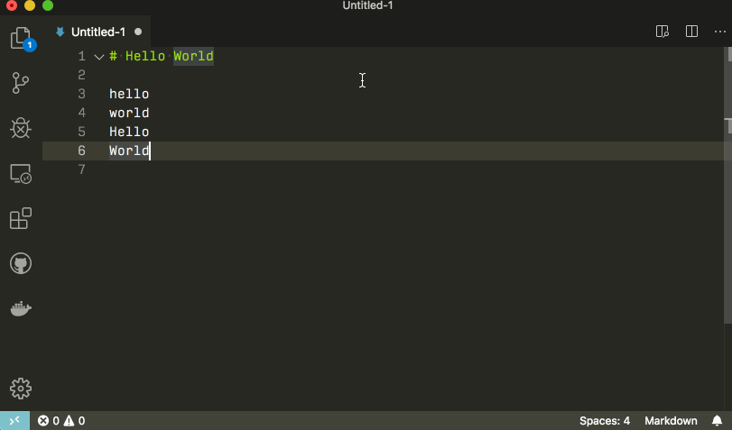
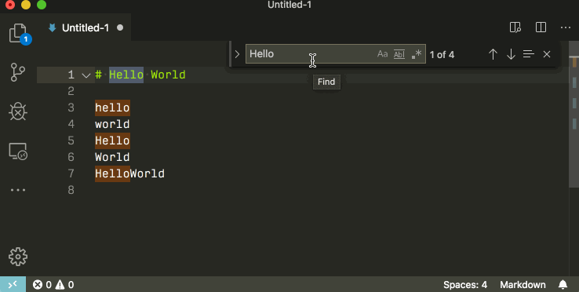
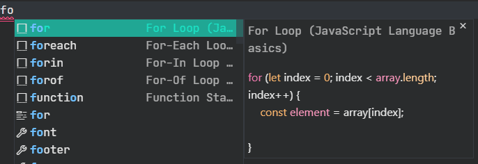

# vscode 笔记

## 01.多光标操作

| 快捷键               | 作用                                         |
| -------------------- | -------------------------------------------- |
| alt+click            | 添加光标                                     |
| Ctrl+D               | 选择光标处的单词，或当前选择的下一个匹配项。 |
| Ctrl+Alt+Down/UP     | 光标上下移动                                 |
| Shift+Alt+Left/Right | 缩小扩大选择范围                             |
| Shift+Alt+drag       | 列 框选择                                    |

多光标

多光标下一个词

扩大，缩小

列选择

## 02.查找和替换

ctrl+F 打开查找，打开时会自动填充选中的文本，如果选择为空，则光标下的单词将被插入到输入框

您可以在查找输入框获得焦点时按 Enter 和 Shift+Enter 导航到下一个或上一个结果。

查找框出现后，点击右侧的图标，或者 alt+L，可以改为**在选中区域中查找**

还支持正则（alt+R），全字匹配(alt+W),大小写匹配(alt+C)

粘贴多行，可以多行查找

ctrl+shift+F 跨文件搜索，也可以点击左侧的搜索按钮

可以排除过滤文件夹，支持 glob 语法

- `*`匹配路径段中的零个或多个字符
- `?`匹配路径段中的一个字符
- `**`匹配任意数量的路径段，包括无
- `{}`对条件进行分组（例如`{**/*.html,**/*.txt}`匹配所有 HTML 和文本文件）
- `[]`**声明**要匹配的字符范围（`example.[0-9]`匹配`example.0`, `example.1`, …）
- `[!...]`否定要匹配的字符范围（`example.[!0-9]`匹配`example.a`, `example.b`, 但不匹配`example.0`）

支持正则替换时替换大小写

在前面加`\l` ,`\u`分别是小写和大写的作用

其中`\u`和`\l`将大写/小写单个字符，并且`\U`将`\L`大写/小写匹配组的其余部分。

修饰符也可以堆叠 - 例如，`\u\u\u$1`将组的前三个字符大写，或者`\l\U$1`将第一个字符小写，其余字符大写。`$n`捕获组在替换字符串中被引用，其中`n`是捕获组的顺序。

## 03.折叠代码

shift + 单击折叠图标折叠或展开区域和内部的所有区域

- 折叠 ( `Ctrl+Shift+[` ) 折叠光标处最里面的未折叠区域。
- 展开 ( `Ctrl+Shift+]`` ) 展开光标处的折叠区域。
- 切换折叠 ( `Ctrl+K Ctrl+L` ) 折叠或展开光标处的区域。
- 递归折叠 ( `Ctrl+K Ctrl+[` ) 折叠光标处最里面的未折叠区域和该区域内的所有区域。
- 递归展开 ( `Ctrl+K Ctrl+]` ) 展开光标处的区域和该区域内的所有区域。
- 全部折叠 ( `Ctrl+K Ctrl+0` ) 折叠编辑器中的所有区域。
- 全部展开 ( `Ctrl+K Ctrl+J` ) 展开编辑器中的所有区域。
- 折叠级别 X（`Ctrl+K Ctrl+2`用于级别 2）折叠级别 X 的所有区域，当前光标位置处的区域除外。
- 折叠所有块注释 ( `Ctrl+K Ctrl+/` ) 折叠所有以块注释标记开头的区域。

## 04.智能提示

vscode 默认支持智能提示的语言是  JavaScript, TypeScript, JSON, HTML, CSS, SCSS, and Less
所以基本上写前端代码是没什么压力的。

ctrl+space 手动触发智能提示

vscode 智能提示的图标

| 图标                                                              | 姓名         | 符号类型                           |
| :---------------------------------------------------------------- | :----------- | :--------------------------------- |
|                               | 方法和功能   | `method`, `function`,`constructor` |
|                             | 变量         | `variable`                         |
|                                | 字段         | `field`                            |
|                         | 类型参数     | `typeParameter`                    |
|                            | 常量         | `constant`                         |
|                                    | 类           | `class`                            |
|                                | 接口         | `interface`                        |
|                             | 结构体       | `struct`                           |
|                                 | 事件         | `event`                            |
|                            | 操作符       | `operator`                         |
|                                | 模块         | `module`                           |
|                                 | 属性         | `property`                         |
|                             | 值和枚举     | `value`,`enum`                     |
|                                | 参考         | `reference`                        |
|                                | 关键词       | `keyword`                          |
|                                  | 文件         | `file`                             |
|                                     | 文件夹       | `folder`                           |
|                             | 颜色         | `color`                            |
|                                    | 单元         | `unit`                             |
|  | 代码片段前缀 | `snippet`                          |
|          | 文本         | `text`                             |

## 05.代码导航

ctrl+p 弹出一个搜索框，可以按名称搜索打开任何一个文件，

搜索框开头输入`：`，再输入数字，可以跳转指定代码行

开头输入@，则下拉框转变为符号搜索，包含所有的变量，字段

**顶部面包屑**

可以在文件夹，文件和符号之间快速导航

要与面包屑交互，请使用**Focus Breadcrumbs**命令或按 Ctrl+Shift+。. 它将选择最后一个元素并打开一个下拉菜单，允许您导航到同级文件或符号。使用向左和向右键盘快捷键转到当前元素之前或之后的元素。当下拉菜单出现时，开始输入——所有匹配的元素都将突出显示，并选择最匹配的元素进行快速导航。

您还可以在没有下拉菜单的情况下与面包屑进行交互。按 Ctrl+Shift+；聚焦最后一个元素，使用 Left 和 Right 导航，并使用 Space 在编辑器中显示元素。

### 转到定义 F12

如果您按下 Ctrl 并将鼠标悬停在一个符号上，将出现声明的预览：

**您可以使用**Ctrl+Click 跳转到定义，或使用 Ctrl+Alt+Click 打开定义到旁边（会分屏在右侧显示）

Ctrl+F12 跳转到符号的实现（比 F12 更深入）

### 符号跳转

您可以使用 Ctrl+Shift+O 在文件内导航符号。通过键入：符号将按类别分组。按向上或向下并导航到您想要的位置

Ctrl+T 跨文件跳转到某个符号。输入您要导航到的类型的第一个字母，无论哪个文件包含它，然后按 Enter。

### 不进行跳转的查看

虽然我一般更喜欢直接跳转

Shift+F12 找到所有引用的地方

Alt+F12 只找一个定义，应该不常用

### 重命名符号

F2

ctrl+f2 是对页面中所有相同符号加光标，可以批量修改

## 06.重构

有很多重构操作，比如提取方法，变量，函数，或者 jsx 组件

单击代码操作灯泡或使用**快速修复**命令 Ctrl+。将显示快速修复和重构。

ctrl+句号

注意和微软拼音输入法切换全半角的快捷键冲突了，可能导致触发不了。

如果您只想查看没有快速修复的重构，可以使用**重构**命令 ( Ctrl+Shift+R )。

## 07.任务

vscode 内置了任务

Ctrl+Shift+B 可以显示检测到的任务列表。

比如 npm 启动的一些 scripts

## 08.代码片段

遵循 TextMate 片段语法，除了内插 shell 代码和`\u`的使用不支持

内置代码片段

